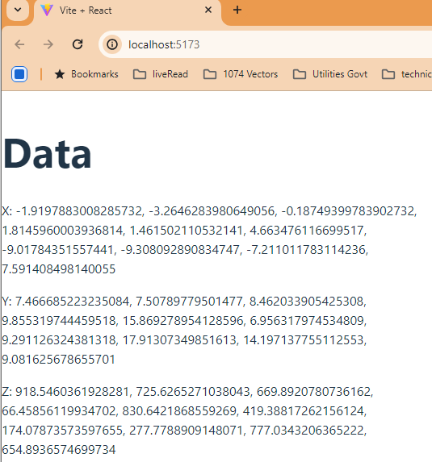

# Websocket based server-client sample (ver 00 basic)
## react-py-ws-periodic-00 
## Readme 
This will show flow of randomly created data on client screen.
### server:
Take python environment with websocket.
> if you are using virtual environement for python, you need to open command shell first on windows. will not work on powershell. just type cmd from PS.
Then execute activate script from server directory. Hint: `venv\Scripts\activate`
Execute python code to start webserver and send data periodically:
`python dataserverws.py` 

it will show something similar to the following output:
```
WebSocket server started on ws://localhost:8765
Emitting data: {'x': [-5.368053124595285, 9.71064696404899, -7.462374328129995, -0.31734866990507626, 0.08286630731110733, 7.844705595907161, -8.310717717550535, -5.922973495455861, -2.2777322033074316, 1.5570948880626077], 'y': [0.31443163579402356, 18.509450199118177, 16.079100311075, 11.282635543275248, 8.947497032875445, 17.692245669810603, 0.3916685062879699, 12.946906508890244, 7.144046874837382, 16.87079226340937], 'z': [584.1197551916179, 600.0626719011456, 850.9998124749663, 0.9769056671254939, 911.5597754911923, 189.4194101316681, 965.8665305428127, 540.4418042873488, 117.14836577094268, 606.3518142033384]} 
```
Emitting data will continue endlessly with a frequency. now it is set as 10 seconds.
### client:
Go to client directory on terminal/shell. then execute app server. 
`npm run dev`

It will show something similar to the following output:
```
> client@0.0.0 dev
> vite


  VITE v5.2.12  ready in 2866 ms

  ➜  Local:   http://localhost:5173/
  ➜  Network: use --host to expose
  ➜  press h + enter to show help
```
You may open `http://localhost:5173/` to see the data sent from the python server. the client will be updating it periodically. Sample output is as follows:
